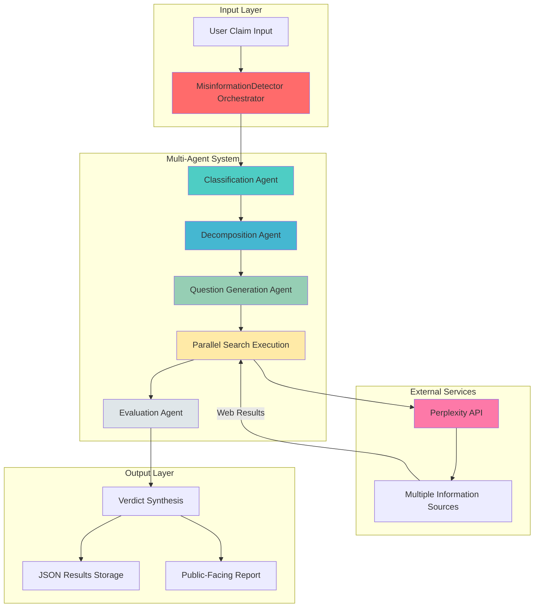
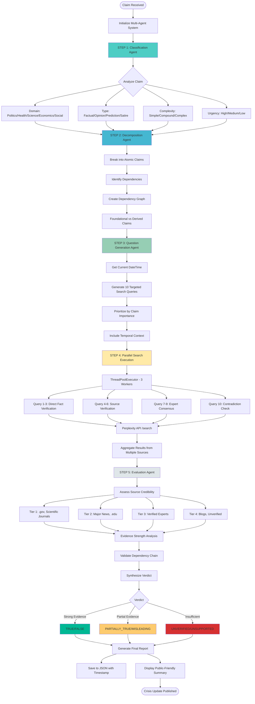
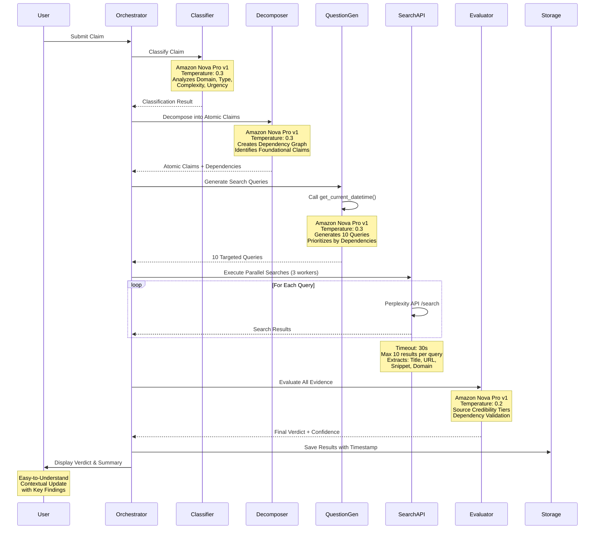
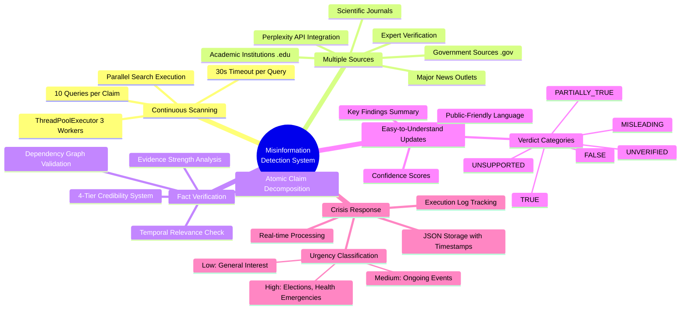
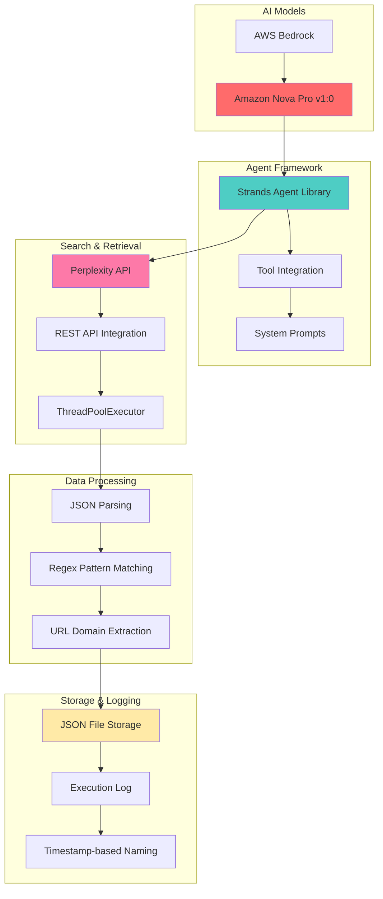
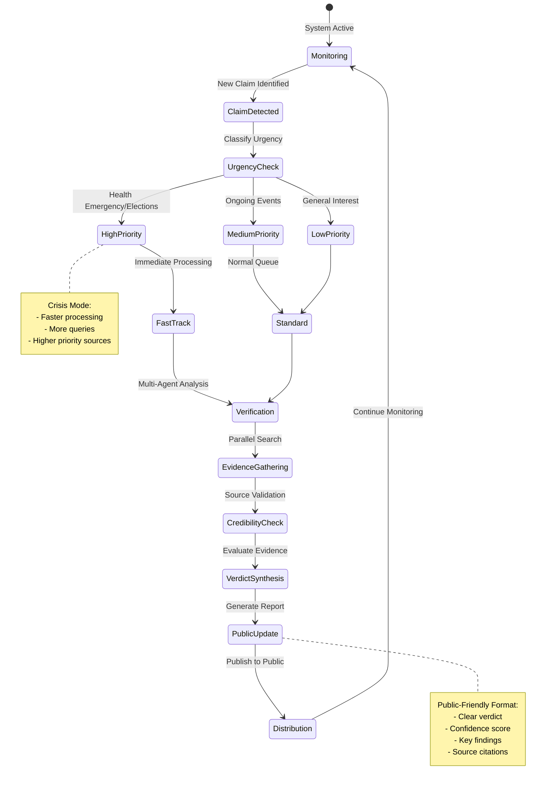

# Agentic AI Misinformation Detection System

## Problem Statement
**Track 3: Misinformation - Problem Statement 1**

Create an Agentic AI system that continuously scans multiple sources of information, detects emerging misinformation, verifies facts, and provides easy-to-understand, contextual updates to the public during crises.

---

## System Architecture

---

## Detailed Workflow

---

## Agent Interaction Sequence

---

## Data Flow Architecture

```mermaid
graph LR
    subgraph "Input Processing"
        A1[Raw Claim] --> A2[Date Context Added]
        A2 --> A3[Classification Metadata]
    end
    
    subgraph "Claim Decomposition"
        A3 --> B1[Atomic Claim 1]
        A3 --> B2[Atomic Claim 2]
        A3 --> B3[Atomic Claim N]
        B1 --> B4[Dependency Graph]
        B2 --> B4
        B3 --> B4
    end
    
    subgraph "Query Generation"
        B4 --> C1[Foundational Queries]
        B4 --> C2[Derived Queries]
        C1 --> C3[10 Optimized Queries]
        C2 --> C3
    end
    
    subgraph "Information Retrieval"
        C3 --> D1[Query Batch 1]
        C3 --> D2[Query Batch 2]
        C3 --> D3[Query Batch 3]
        D1 --> D4[Perplexity API]
        D2 --> D4
        D3 --> D4
        D4 --> D5[Aggregated Results]
    end
    
    subgraph "Evidence Analysis"
        D5 --> E1[Source Credibility Scoring]
        E1 --> E2[Evidence Strength Assessment]
        E2 --> E3[Dependency Chain Validation]
        E3 --> E4[Verdict Synthesis]
    end
    
    subgraph "Output Generation"
        E4 --> F1[Overall Verdict]
        E4 --> F2[Sub-Claim Verdicts]
        E4 --> F3[Confidence Score]
        E4 --> F4[Key Findings]
        F1 & F2 & F3 & F4 --> F5[JSON Report]
        F1 & F2 & F3 & F4 --> F6[Public Summary]
    end
    
    style A1 fill:#74b9ff
    style D4 fill:#fd79a8
    style E4 fill:#55efc4
    style F5 fill:#ffeaa7
    style F6 fill:#ff7675
```

---

## Key Features Addressing Problem Statement

---

## Technology Stack

---

## Configuration & Performance

| Parameter | Value | Purpose |
|-----------|-------|---------||
| **NUM_SEARCH_QUERIES** | 10 | Comprehensive coverage of claim aspects |
| **MAX_PARALLEL_WORKERS** | 3 | Optimal balance of speed and API limits |
| **SEARCH_TIMEOUT** | 30s | Prevent hanging on slow sources |
| **MAX_TOKENS_CONFIG** | 4096 | Detailed analysis capability |
| **Temperature** | 0.2-0.3 | Balance creativity and accuracy |

---

## Crisis Response Workflow

---

## System Benefits

### ✅ Addresses Problem Statement Requirements

1. **Continuous Scanning**: Parallel search execution with configurable workers
2. **Multiple Sources**: Perplexity API aggregates from diverse information sources
3. **Misinformation Detection**: 4-agent system with specialized roles
4. **Fact Verification**: Evidence-based evaluation with credibility tiers
5. **Easy-to-Understand Updates**: Structured verdicts with confidence scores
6. **Contextual Information**: Dependency graphs and temporal relevance
7. **Crisis Response**: Urgency classification and real-time processing

### 🚀 Technical Innovations

- **Dependency Graph Validation**: Ensures logical consistency in complex claims
- **Atomic Claim Decomposition**: Breaks down compound statements for precise verification
- **Multi-Tier Credibility System**: Weights sources by reliability
- **Temporal Context Awareness**: Uses current date for recent event verification
- **Parallel Processing**: Efficient information retrieval with ThreadPoolExecutor

### 📊 Output Quality

- **Structured JSON Reports**: Machine-readable results with full audit trail
- **Confidence Scoring**: Quantifiable trust metrics (0.0-1.0)
- **Verdict Categories**: 6 distinct classifications for nuanced assessment
- **Key Findings**: Digestible summaries for public consumption
- **Execution Logging**: Complete transparency of decision-making process
